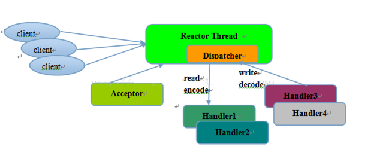
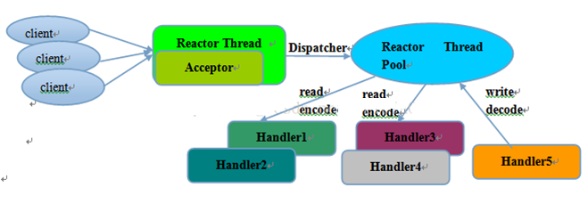

# Reactor线程模型

## Reactor单线程

> 所有的I/O操作都在同一个NIO线程上完成

## Reactor多线程

> 一组NIO线程处理I/O操作

## 主从Reactor多线程

> 一组NIO处理读写和编码，一组NIO处理客户端登录，握手，安全验证

[Reactor线程模型的理解]: https://www.cnblogs.com/ghghg/p/12689227.html	"true"

