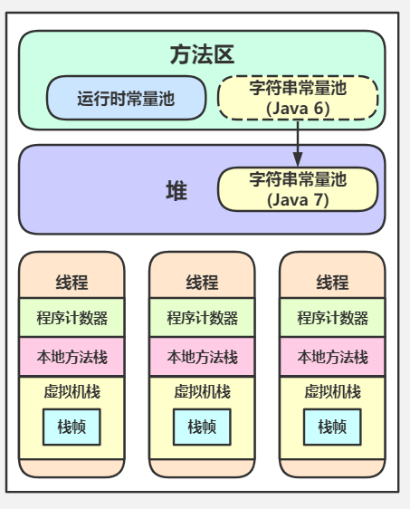

# JVM
## 简介

## 运行配置命令及参数调优

```bash
-XX:+UseSerialGC -Xms20M -Xmx20M -Xmn10M -XX:SurvivorRatio=8
# -XX:+UseSerialGC 指定GC Serial+SerialOld收集器组合
# -Xms20M 指定堆内存初始大小20M
# -Xmx20M 指定堆内存最大大小20M
# -Xmn10M 指定堆内存最小大小10M
# -XX:SurvivorRatio 指定 Eden:Survivor=8:1

```


## 内部结构分区

Java 虚拟机的内存空间分为 5 个部分：

- 程序计数器
- Java 虚拟机栈
- 本地方法栈
- 堆
- 方法区

JDK 1.8 同 JDK 1.7 比，最大的差别就是：元数据区取代了永久代。元空间的本质和永久代类似，都是对 JVM 规范中方法区的实现。不过元空间与永久代之间最大的区别在于：元数据空间并不在虚拟机中，而是使用本地内存。




## 垃圾回收

## HotSpot


## JIT


## OOP-Klass模型

## 调优

> 递归调用可以导致栈溢出
> 不断创建对象可以导致堆溢出


## [使用rust写一个JVM]()