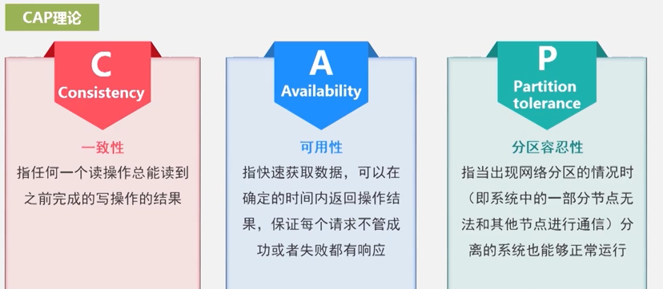

# NoSQL数据库

## 简介

> Not Only SQL

- web2.0
  - 不要求事务
  - 不要求实时性
  - 无复杂的sql查询

- 特点
  - 可扩展性、高可用性
  - 灵活的数据模型

- 案例
  - hbase
  - hadoop
  - mongodb
  - redis

## 与关系型数据库的比较

- 数据库原理

  - 关系型		完整的理论基础(三大范式)
  - 非关系型    缺乏理论基础

- 数据规模

  关系型难以扩展

- 数据库模式

  数据模型灵活

- 查询效率

  复杂查询采用关系型

- 事务一致性

  base模型 

- 数据完整性

  关系型具有完整性的完整机制

- 扩展性

  关系型难以扩展

- 可用性

  关系型先保持一致性

- 标准化

  关系型遵循sql语句标准

- 技术支持

- 可维护

  非关系型更加复杂

## 常用NoSQL数据库

| 类型       | 特点                                       |数据模型| 应用场景|典型                   |
| ---------- | ------------------------------------------ | ----- |  ----- | ---------------------- |
| 键值数据库 | 就是键值两个字段                           | 键是字符串，值可以是任意类型，整形、字符串、数组、列表、集合等 |频繁读写，缓存，如会话，配置文件，参数，购物车，不支持通过值查找，扩展性好，灵活，用于缓冲层|redis、amazib DynamoDB |
| 列族数据库 | 根据列族进行垂直划分，根据行键进行水平划分 |列族| 动态增加字段，查询快，可扩展性抢，复杂性低，不适用强一致性 |hbase、bigTable        |
| 文档数据库 | 可以看做键值数据库，值为文档而非标量       |能对值进行自我描述，json 格式| 更好的并发性(更新操作单个文档)，半结构化数据，嵌入式文档功能 |mongodb、Couchbase     |
| 图数据库   | 图结构存储信息                            |图结构| 处理有相互关联关系的数据，社交网络，模式识别，依赖分析，推荐系统以及路径查找。应用范围有限 | neo4j、InfiniteGragh   |

## NoSQL理论基础

三取二

