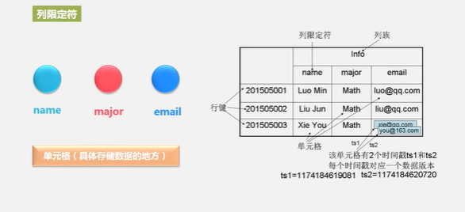
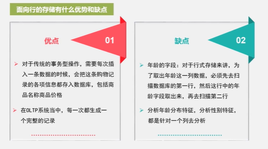
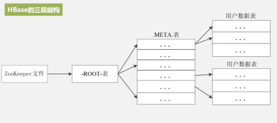
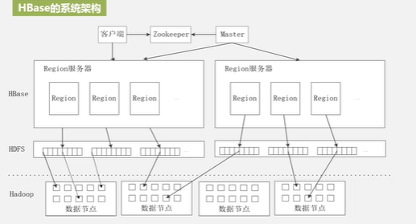
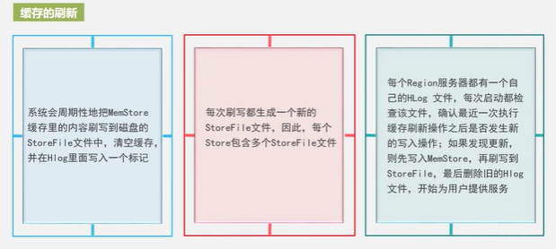
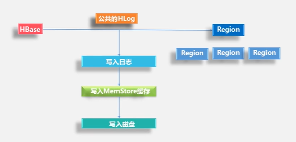

# HBase

## 简介

> BigTable 开源实现
>
> - 用户网页搜索
> - 架构于GFS

> PB级
>
> 可扩展

> 存储半结构化数据

- 联系与区别
  - 数据类型，关系型数据库关系数据模型，hbase数据类型不敏感
  - 数据操作，hbase无连接操作
  - 存储模式，行存储与列存储
  - 索引，hbase只支持对行键索引
  - 数据维护，hbase会保留旧版本
  - 可伸缩方面
- 访问接口
  - java api
    - shell
    - thrift gateway
    - rest gateway
  - sql
    - pig
    - hive

## 数据模型

> 稀疏 多维 排序
>
> 不同列族存到不同文件

1. 列限定符
2. 每个值都是未经解释的字符串也就是Bytes数组
3. 一个行可以有一个行键和任意多个列
4. 列族 (info) 支持动态扩展，保留旧的版本



- 数据坐标概念

  - HBase对数据的定位
    - 采用四维坐标定位
    - 行键 列族 列限定符 时间戳
  - 传统关系型数据库的定位
    - 只要通过行列可以确定唯一数据
    - Excel表格

- 列式存储



## 实现原理

- 功能组件

  - 库函数 

    一般用于连接每个客户端

  - Master服务器 管家

    1. 分区信息进行维护和管理
    2. 维护了一个Region服务器列表
    3. 整个集群当中有哪些Region服务器在工作
    4. 负责对Region进行分配
    5. 负载均衡

  - Region服务器 

    存储Region 客户端访问数据

- 表和Region

  - 一个Region会分裂多个Region
  - Region的大小为100MB~200MB
  - 一个Region的大小最佳配置为1GB~2GB
  - Region的实际大小，取决于单个服务器的有效处理能力
  - 对于同一个Region他是绝对不会被拆分到不同Region服务器上去

- Region的定位 (三层架构)

  - 元数据表 Region ID,Region服务器ID
  - 映射表为.META表
- 三层寻址+缓存+惰性失效
  
  

| 层次   | 名称          | 作用                |
| ------ | ------------- | ------------------- |
| 第一层 | Zookeeper文件 | 记录了-ROOT表的位置 |
|第二层|-ROOT-表|记录了.META表的信息 -ROOT-表只能有一个Region。通过-ROOT-表就可以访问.META 表中的数据|
|第三层|.META表|记录用户数据表的Region位置系信息。.META表可以有多个Region。保存了HBase中所有用户数据表的Region位置信息|

## 运行机制

- 系统架构
  - 客户端 访问接口
  - zookeeper 管理hbase集群
  - master 表和region的管理工作 负载均衡
  - region服务器 用户读写数据




- 读写数据
  1. 缓存 region服务器
  2. memstore 缓存 如果没有就取 磁盘发storeFile



- storeFile 合并与分裂

- HLog 工作原理

  

## 应用方案

- 性能优化方法

  - 查询

    ` Long.MAX_VALUE - timestamp`

  - 读写

    1. `HColumnDescriptor.setInMemory` 设为`true`

    2. 相关表放到Region服务器的缓存中，根据需要来决定是否放入缓存
    3. `HColimnDescriptor.setVersionsMaxVersions` 设置最大版本数，只保留最新则设置为1，节省存储空间
    4. 自动清理，设置`TimeToLive`

- 检测性能

  - Master-status 自带web界面
  - Ganglia 开源集群监控
  - OpenTSDB 集群监控
  - Ambari Hbase监控

- SQL引擎及二级索引

  - 优点

    - 简洁
    - 易于使用

  - 方式

    - Hive
    - Phoenix

  - 二级索引/辅助索引

    单个行键 区间访问 scan

    - Coprocessor

      > Hindex redis solr

      endpoint 相当于关系型数据库的存储过程，observer相当于触发器

      主表+索引表

  

## 安装

略

## 命令

```bash
./hbase shell
create 'student','Sname','Ssex','Sdept','course'
describe 'student'
put 'student','99','Sname','Li'
put 'student','99','course','math'
delete 'student','99','Sname','Li'
deleteall 'student','99'
get 'student','99'
scan 'student'
disable 'student'
drop 'student'
exit
```

## java api

