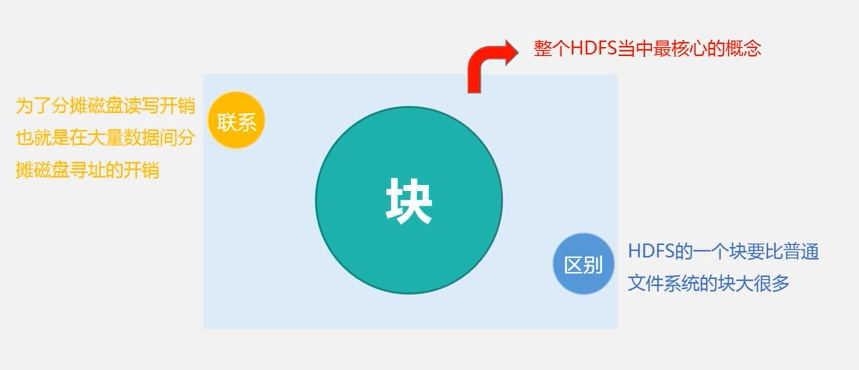
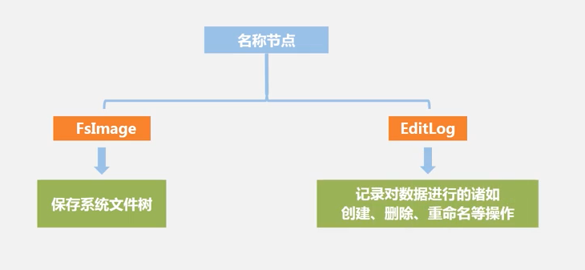
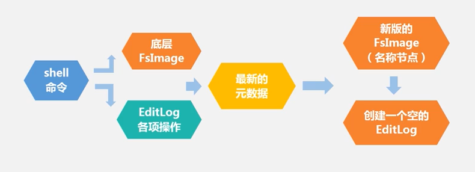
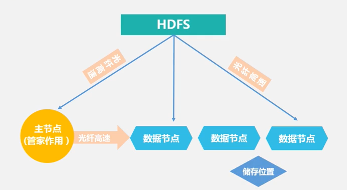
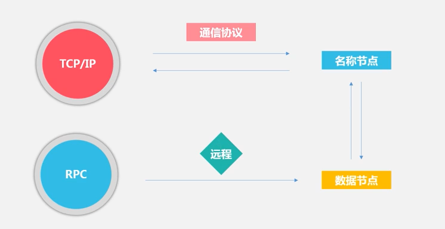
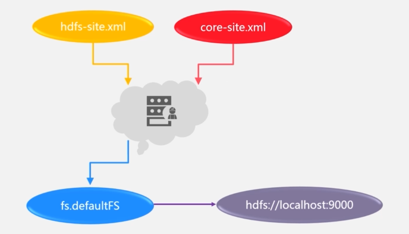
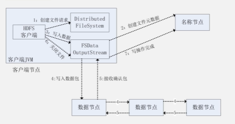

# 分布式文件系统

## HDFS

### 集群基本架构

### 文件系统结构

### HDFS实现目标

- 兼容链家的硬件设备
- 实现流数据读写
- 支持大数据集
- 支持简单的文件模型
- 强大的跨平台兼容性

### HDFS局限性

1. 不适合低延迟数据访问
2. 无法高效存储大量小文件
3. 不支持多用户修改文件

## HDFS相关概念

- 块

  

  > 面向大规模数据存储
  >
  > 降低分布式节点的寻址开销

  > 过大影响并行处理


- 名称节点-> HDFS管家 (数据目录)




启动流程



> 第二名称节点 处理editlog过大问题
>
> 定期通信主名称节点

- 数据节点 -> 存储具体数据

## HDFS体系结构

> 主从架构



通信协议

> 基于TCP/IP



局限性

> 命名空间限制：内存空间上限
>
> 性能瓶颈：节点吞吐量
>
> 隔离问题：
>
> 集群问题：单点故障 2.0 解决

## HDFS存储原理

> 伪分布式

1. 加快数据传输
2. 容易检查错误
3. 保证数据可靠性


## HDFS数据读写

> conf 加载数据
>
> 

- 读数据

```java
    Configuration conf = new Configuration();
    FileSystem fs = FileSystem.get(conf);
// 打开文件
    Path filename = new Path("hdfs://localhost:9000/user/hadoop/test.txt");
// 读取请求 获取数据节点 读取数据 获取数据块信息 读取数据 读下一个数据 读数据块块
// FSDataInputStream 封装了DFSDataInputStream
    FSDataInputStream is = fs.open(filename);
    BufferedReader d = new BufferedReader(new InputStreamReader(is));
    String content = d.readLine();
    System.out.println(content);
    d.close();
    fs.close();
```


- 写数据

```java
// 创建请求
// 创建文件元数据 是否存在 是否有权限
// 写数据 流水线复制 分包 ->DFS 名称节点申请
// 写入数据包 
// 关闭文件
```



## HDFS实践

[厦门大学实验室](https://dblab.xmu.edu.cn/blog)

#### 命令

```bash
hdfs dfs -ls /
hdfs dfs -mkdir -p /user/hadoop
hdfs dfs -rm -f /user
hdfs dfs -input aa.txt input
hdfs dfs -cat input/aa.txt
hdfs dfs -get input/aa.txt .
hdfs dfs -cp input/aa.txt input/bb.txt
```

