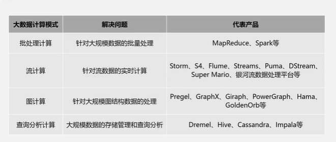
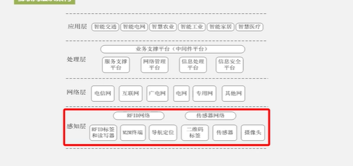
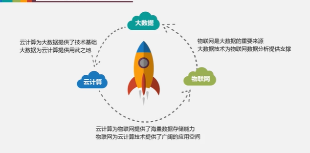

# 大数据概述

## 大数据时代

信息化浪潮

1. 个人计算机
2. 互联网
3. 物联网、云计算、大数据

技术支撑

	1. 存储
 	2. 网络带宽

数据产生

​	运营式系统 --- 用户原创--- 感知式(物联网)

## 大数据概念和影响

4v 

1. 数据量大(结构化数据，非结构化数据)
2. 处理速度快(秒级决策)[Dremel-- 集群交互式]
3. 价值密度低，商业价值高

影响

科学研究的四种范式 

 	实验、数据、理论、计算

思维方式

- 全样而非抽样
- 效率而非精确

- 相关而非因果

## 大数据应用

- 影视剧投拍
- 谷歌预测流感

## 大数据关键技术

- 数据存储管理
  - 分布式存储
- 数据处理与分析
  - 分布式处理

不同计算模式使用不同的产品

	1. 批处理（MapReduce、Spark）--离线处理
 	2. 流计算(S4、Storm、Flink)--实时计算
 	3. 图计算(Graphx) --社交网络
 	4. 查询分析计算(Dremel、Hive、Impala)

## 大数据与云计算、物联网关系

### 云计算

云计算(虚拟化、多租户)

优势：租用云端资源、无需自建维护

公有云、私有云、混合云

三种 IaaS 基础设置及服务（服务器）

PaaS 平台即服务（平台作为服务）

SaaS 软件即服务（云软件服务）Salesforce

云计算数据中心

​	政务云 教育云 企业云 医疗云

### 物联网

- 感知层

- 网络层（掌上智能公交）

- RFID 条形码 二维码

  智慧城市

### 关系

大数据继承自云计算