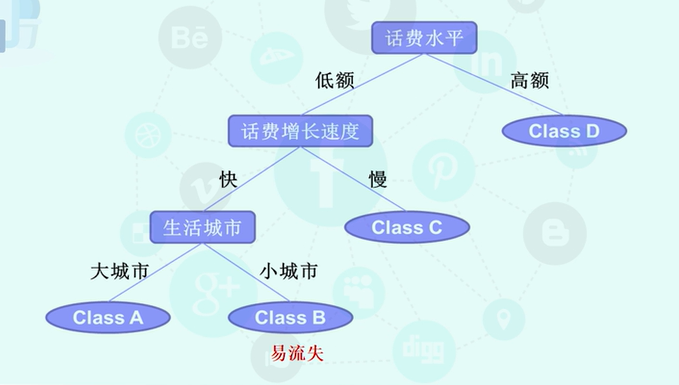

# 数据挖掘的方法

- 分类(*Classification*)

  > 通过对具有类别的对象所应承担数据集进行学习。

  - 例： 电信用户分类决策树模型

    

- 聚类(*Clustering*)

  > 将没有类别的对象根据对象特征，聚成不同簇的过程，同一簇的对象之间较相似

  - 例： 客户群分类

| 相同点               | 不同点                                           |
| -------------------- | ------------------------------------------------ |
| 都属于对数据进行归类 | 分类针对有标签的数据分析，聚类针对没有标签的数据 |

- 关联(*Association*)

  - 例：啤酒与尿布

- 数值预测

  > 连续变量的取值

  - 例： 回归分析

- 异常点挖掘(孤立点分析)

  > 异常检测，与一般数据不一致的孤立点

- 序列分析

- 社会网络分析