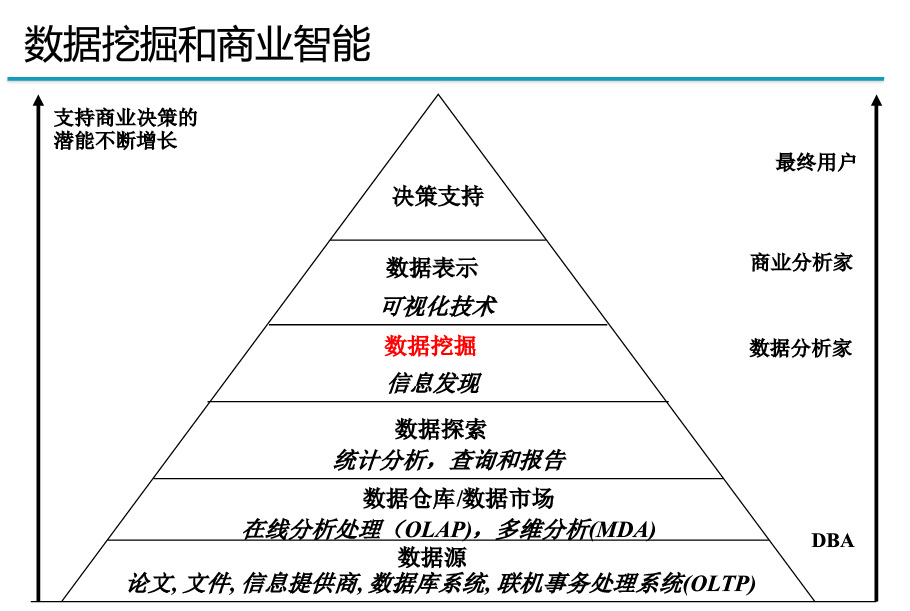

# 数据挖掘的产生、定义和流程

## 原因

> 数据丰富，但缺乏有用信息

**解决方法: 数据仓库技术和数据挖掘技术**

- 数据仓库(Data Warehouse)和在线分析处理(OLAP)

  ​	—— 对存储和管理提供基础

- 数据挖掘

  ​	—— 是时代发展的需求

## 概念

> 挖掘感兴趣有用的数据模式或知识
>
> KDD、知识提炼、数据/模式分析、数据考古、数据捕捞、信息收获

## 流程

1. 了解应用领域
2. 创建目标数据集：选择数据
3. 选择数据，数据清洗和预处理(*60%工作量*)，数据压缩和变换
4. 选择数据挖掘的技术、功能和合适的算法，进行数据挖掘
5. 寻找感兴趣的模式
6. 模式评估和知识表示
7. 运用发现的知识

## 数据类型

> 事物描述的符号

- 表现形式

  文字、数字、图像、声音等

- 存储方式

  结构化(*统一的二维表格*)、非结构化(*文档、音频、视频、图片等*)、半结构化

## 数据来源

- 关系型数据库
- 空间数据
- 时间数据库和时间序列数据库
- 多媒体数据
- 流数据
- 异构数据库和历史数据库
- 文本数据库和万维网

