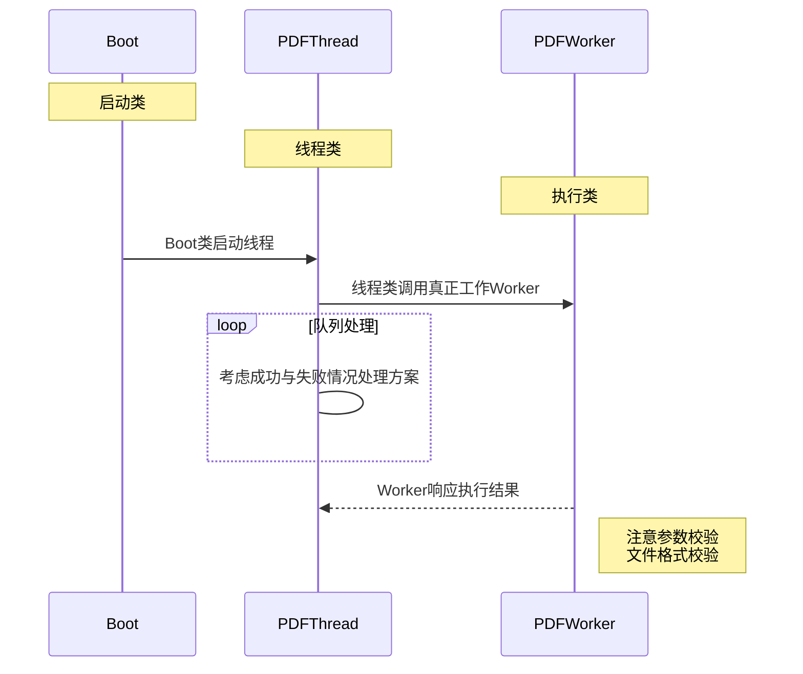

```markdown
# 这是一级标题
## 这是二级标题
```

# 这是一级标题
## 这是二级标题

```text```
* 列表1
    - 子列表
1. 编号
*斜体* _斜体文本_ **粗体文本** __粗体文本__ ***粗斜体文本*** ___粗斜体文本___
分隔线： *** * * * ***** - - - ----------
删除线： ~~BAIDU.COM~~
下划线： <u>带下划线文本</u>
脚注： [^要注明的文本] [^要注明的文本]: 啊啊啊
区块： > 区块引用
链接： 这是一个链接 [github](https://www.github.com)
高级链接: 高级链接Google [Google][1]
图片:  
[1]: http://www.google.com/
` 单行代码串`
​```markdown 多行代码 ```
|表格|标题|表头|
|----|----|----|
|aa|bb|cc|




* 列表1
    - 子列表
1. 编号
    *斜体* _斜体文本_ **粗体文本** __粗体文本__ ***粗斜体文本*** ___粗斜体文本___

----------

  ~~BAIDU.COM~~ <u>带下划线文本 </u>[^要注明的文本]
 > 区块引用

这是一个链接 [github](https://www.github.com) 

高级链接Google [Google][1]

 ` 单行代码串`

```markdown
多行代码 
```

| 表格 | 标题 | 表头 |
| ---- | ---- | ---- |
| aa   | bb   | cc   |

<h1>html 语法</h1>

[^要注明的文本]: 

[1]: http://www.google.com/
```

```