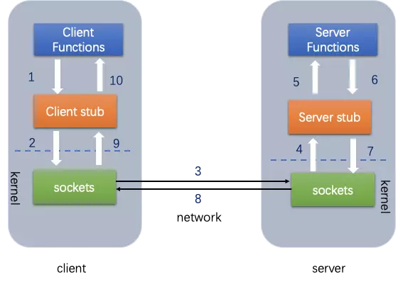

# RPC

## 简介

RPC(Remote Procedure Call) 远程过程调用，即节点之间的请求服务。

## 关键技术

1. Call ID映射
2. 序列化与反序列化
3. 网络传输

## 特性

## 常见的技术框架

- Netty
- gRPC
- SpringCloud（Spring的，基于Socket的，SOA架构的分布式框架）
- Dubbo(x)（阿里巴巴的，基于Socket的，SOA架构的分布式框架）
- WebService（跨语言的，基于SOAP协议，走xml数据或json数据）
- Hessian（跨语言的，基于Binary-RPC协议，走二进制数据）
- HttpClient（通常用于RESTful风格的调用，跨语言，基于http和json）
- EJB远程接口调用
- jdk原生（HttpURLConnection）